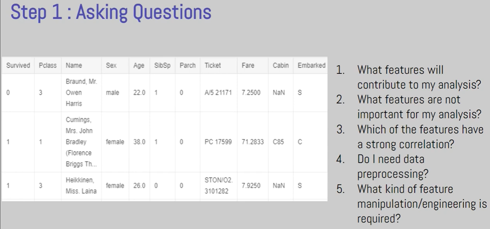
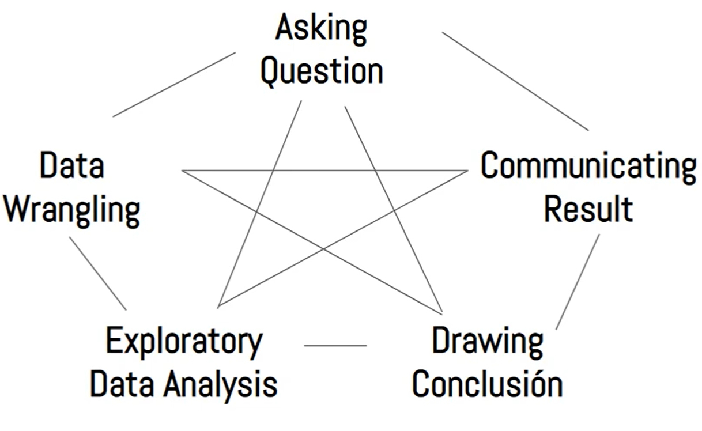

# Data Analysis

Data analysis is a process of inspecting, cleansing, transforming, and modelling data with the goal of discovering useful information, informing conclusions, and supporting decision-making.

# Data Analysis Process

The data analysis process can be broken down into 5 steps:

- Asking the right Questions
- Data Wrangling
- Exploratory Data Analysis
- Drawing Conclusions
- Communicating Results

## **Asking Right Questions**

To ask Better Question

- Subject Matter Knowledge/Expertise
- Experience

## **Data Wrangling/Munging/Preprocessing** (Cleaning the Data, takes most of the time)

Process of transforming/mapping data from one format "raw" data form into another format with intent of making it more appropriate and valuable for a variety of downstream purpose like analytics.

It is the method of analyzing, filtering, transforming and encoding data so that a machine learning algorithm can understand and work with the processed output.

A considerable chunk of any data-related project is about data preprocessing and data scientists spend around 80% of their time on preparing and managing data.

- Algorithms that learn from data are simply statistical equations operating on values from the database. So, as the popular saying goes, “if garbage goes in, garbage comes out”.
- Your data project can only be successful if the data going into the machines is high quality.

This is done is 3 major steps:

- Gathering Data
  - Collecting data to work on
  - The data can either be given directly in a csv file or we need to collect it using API's or with Webscrapping or directly from the database.
- Assessing Data
  - Finding number of rows and columns (shape)
  - Memory occupied by dataset, Data type of various column and checking for missing values (info())
  - Check for duplicate data (is_unique())
  - High Level mathematical overview of data (describe())
- Cleaning Data
  - What to do with missing data (replace them by mean, median, mode or remove the column itself).
  - Remove Duplicate Data
  - Change incorrect Data type

## **Exploratory Data Analysis** (Trying to find pattern in data)

We explore and augment the data.

Exploring Data is about

- Finding Correlation and Covariance
- Doing univariate and multivariate analysis
- Plotting Graph aka Data Visualization

Feature Engineering (Augmenting Data) is about

- Removing Outliers in scatterplots
- Merging Dataframes
- Adding new Columns

## **Drawing Conclusions** (Result of EDA)

This can be done in various ways like Machine Learning, Inferential Statistics, Descriptive Statistics.

## **Communicating Results/ Data Storytelling**

Here Communication Skills is the key.

- The best part about this is we are not required to do these steps linearly
  

# **Data Wrangling**

Preprocessing the data for ML involves both data engineering and feature engineering.

- Data engineering is the process of converting raw data into prepared data.
- Feature engineering then tunes the prepared data to create the features that are expected by the ML model.

This is done is 3 major steps:

- Gathering Data
  
- Assessing Data
- Cleaning Data

## Gathering Data

The data can either be given directly in a csv file or we need to collect it using API's or with Webscrapping or directly from the database.

## **Assessing Data**

It is about getting the dataset and then analysing and assesment of data so we can clean it in the next step.

There are several options for getting the dataset into Jupyter:

- Download the CSV manually and upload it via Jupyter's GUI
- Use the urlretrieve function from the urllib.request to download CSV files from a raw URL
- Use a helper library, e.g., opendatasets, which contains a collection of curated datasets and provides a helper function for direct download.

For accessing the data we need to know what is unclean data and how we should access it.

### **Types of Unclean data**

There are 2 kinds of unclean data

- Dirty Data (Data with Quality/Content Issue)
- Messy Data (Data with tidiness/structural Issue)

1. **Dirty Data**

It has following kind of issues:

- Duplicate Data
- Missing Data
- Corrupt Data
- Inaccurate Data

1. **Messy Data**

Tidy data has following traits:

- Each Variable forms a column
- Each observation forms a row
- Each Observational unit forms a table

If any of the above trait is voilated then it is untidy/messy data.

### **Type of Assessment**

There are 2 types of assessment styles

- **Manual**: Looking through data manually in google sheets
- **Programmatic**: By using pandas function like info(), describe(), sample(), etc.

Steps in Assessment include 2 steps:

- Discover
- Document

We first discover the issues and then document it and later in the data cleaning step all these issues are resolved.

### **Data Quality Dimensions for sorting Dirty data**

There are 4 major type of quality issues

1. **Completeness Issues**: Data is missing
2. **Validity Issues**: Data is available but not valid
3. **Accuracy Issues**: Data is available and valid but not accuratae
4. **Consistency Issues**: Data is inconsistent

## Cleaning Data

Data Cleaning is particularly done as part of data preprocessing to clean the data by filling missing values, smoothing the noisy data, resolving the inconsistency, and removing outliers.

- It is the process of fixing or removing incorrect, corrupted, incorrectly formatted, duplicate, or incomplete data within a dataset.

While cleaning you should follow the order provided below:

- Completeness Issues
- Tidiness Issues
- Remaining Data quality issues like validity, accuracy and consistency

### Steps involved in Data cleaning

- Define what you need to clean
- Code to clean
- Test if data is cleaned properly or not

`Always make sure to create a copy of your pandas dataframe before you start the cleaning process.`

### Handling Missing Values

To handle missing data we can do imputaion or dropping.

Imputation is the process of replacing missing data with substituted values like mean, median or mode.

### Handling Imbalanced Data

Undersampling

# **Exploratory Data Analysis**

EDA is mostly done in 3 steps:

- Analysis
- Feature Engineering
- Handling Outliers

> The entire EDA process is iterative.

EDA analysis can be univariate analysis, bivariate analysis or multivariate analysis.

- Univariate Analysis is when we analyse only 1 column.
- Bivariate Analysis is when we analyse 2 columns at once.
- Multivariate Analysis is when we analyse more than 2 columns at once.

Columns can be of 2 types:

- Numerical
- Categorical

## **Univariate Analysis**

# Feature Engineering

A feature is typically a specific representation on top of raw data, which is an individual, measurable attribute, typically depicted by a column in a dataset.

Features can generally be divided into two categories, Raw features and Derived features.

- Inherent raw features are obtained directly from the dataset with no extra data manipulation or engineering.
- Derived features are usually obtained from feature engineering, where we extract features from existing data attributes.
  - For example, only the user's date of birth in the dataset, then we can get the Derived feature of age according to the birthday.

Feature engineering is the process of transforming raw data into features that better represent the underlying problem to the predictive models, resulting in improved model accuracy on unseen data.

- Feature Engineering is an art as well as a science and this is the reason Data Scientists often spend 70% of their time in the data preparation phase before modeling.
- At the end of the day, some machine learning projects succeed and some fail. Easily the most important factor is the features used.

The original data set will have a variety of features, the most common features includes, continuous numeric features and categorical features.

To do feature engineering well, we should first understand the data. Generally, look at data distribution, mean, standard deviation and quantile first.

Feature Engineering includes:

- Feature Transformation
  - Missing value imputation
  - Handling categorical features
  - Outliers detection
  - Feature scaling
- Feature Construction
- Feature Selection
- Feature Extraction

## Feature Transformation

Once data clearing has been done, we need to consolidate the quality data into alternate forms by changing the value, structure, or format of data such that the machine can properly understand it.

- Numerical Data Processing includes steps like Standardization, Normalization while Textual Data Processing includes techniques like Stopwords removal, Stemming/Lemmetization.

### Outlier treatment

Outliers are data points that do not conform with the predominant pattern observed in the data. They can cause disruptions in the predictions by taking the calculations off the actual pattern.

Outliers can be detected and treated with the help of box-plots.

- Box plots are used to identify the median, interquartile ranges and outliers.

To remove the outliers, the maximum and minimum range needs to be noted, and the variable can be filtered accordingly.

### Handling Numeric Data

The advantage of numerical features is that they can generally be used directly as inputs for mathematical operations.

Even though numeric data can be directly fed into machine learning models, you would still need to engineer features which are relevant to the scenario, problem and domain before building a model.

Binarization, Rounding, Interactions, Binning/Quantization, Statistical Transformation.

Binarization, binning or even dividing are actually equivalent to converting continious numerical features into discrete(categorical) features, and then into one-hot forms.

Binning can be fixed width and adaptive.

### Handling Categorical Data

Some algorithms can work with categorical data directly. But many machine learning algorithms cannot operate on label data directly. They require all input variables and output variables to be numeric.

In general, this is mostly a constraint of the efficient implementation of machine learning algorithms rather than hard limitations on the algorithms themselves.

So categorical data must be converted to a numerical form. If the categorical variable is an output variable, you may also want to convert predictions by the model back into a categorical form in order to present them or use them in some application.

There are two major classes of categorical data, nominal and ordinal.

- In any nominal categorical data attribute, there is no concept of ordering amongst the values of that attribute.
- In any nominal categorical data attribute, there is no concept of ordering amongst the values of that attribute.

Typically any standard workflow in feature engineering involves some form of transformation of these categorical values into numeric labels and then applying some encoding scheme on these values.

Label encoding is simply converting each value in a column to a number.

When doing label encoding it labels categories as 0,1,2,3…. Now since 0<1<2, the equations in the regression model may thing one category has a higher value than the other, which is of course not true.

- To solve this situation we have a concept called **Dummy variables**.
- In regression analysis, a dummy variable is one that takes the value 0 or 1 to indicate the absence or presence of some categorical effect that may be expected to shift the outcome.

Concept of dummy variables can be done using one-hot encoding, dummy coding, effect coding, Bin-counting, hash embedding.

### Feature Scaling

It is a technique to standardize the independent features into fixed range.

This includes standardization and normalization.

Standardization is also called Z-score Normalization.

- After standardization the mean of the new feature will be 0 and it's standard deviation will be 1.

## Feature Encoding

Sometimes, data is in a format that can’t be processed by machines. For instance, a column with string values, like names, will mean nothing to a model that depends only on numbers.
